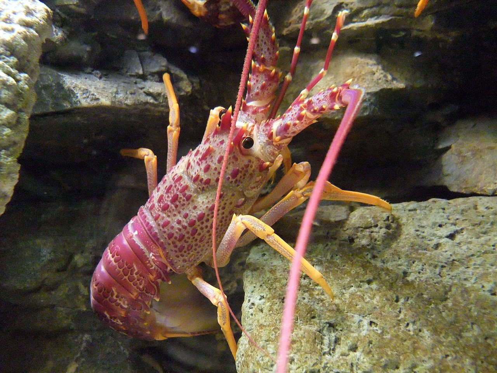

```{r setup, include=FALSE}
knitr::opts_chunk$set(echo = FALSE, warning = FALSE, message = FALSE)
```
```{r}
library(tidyverse)
library(janitor)
library(kableExtra)
library(scales)
library(here)
library(broom)
library(purrr)
```

### Introduction

On, January 1st, 2012 the California Fish and Game Network established Marine Protected Areas (MPA) {include something about legislation and designation levels} in the waters off Isla Vista and Naples, California. This came as an effort to better understand factors such as abundance, size, and fishing pressure on the California spiny lobster as well as natural kelp forest community dynamics and the affects MPA’s have on them{CITATION OF ABSTRACT}. Previous studies suggested that small isolated marine protected areas are effective at increasing abundance and size of *P.interruptus* {CITATION}. Using data collected from five sites along the Santa Barbara coastline, including the two Marine Protected Areas mentioned above, by the Santa Barbara Coastal Long Term Ecological Research program (SBC LTR), we explore lobster population and size changes over six years in an attempt to show MPA effectiveness .{NEED CITATION ABSTRACT}.
```{r, out.width = "400px", fig.cap="**Figure 1:** *Panulirus interruptus* in its natural habitat. Credit: [Wikipedia, Stemonitis - Own work](https://commons.wikimedia.org/w/index.php?curid=14499898)",fig.align='center'}

```


### Data and Methods

Data for *P. interruptus* size and abondance was collected between 2012 and 2018. This data was collected by the 
Data for Swedish Griffin abundance and location from 1984 - 2019 were collected and provided by the Fantastic Beasts Research Team. Griffin abundance (individuals) is estimated from annual aerial counts. Griffin location (latitude, longitude) is uploaded daily from GPS-enabled collars, and used to estimate range areas (km2). For more information on collection methods and spatial information, see metadata. Habitat shifts were based on aerial observation and GPS locations, and were binned for this report as “Grassland”, “Forest” or “Exposed rock”. Mean griffin range area (km2) was compared for pre-dragon (1984 - 2004) and post-dragon (2005 - 2019) periods by two-sample t-tests (α = 0.05 throughout). Trends in Griffin abundance were compared before and after dragon reintroduction by linear regression. All analyses and figures were prepared using R software version 3.6.1{DATA AND METHODS INCLUDE TIME SERIES PLOT FOR LOBSTER ABUNDANCE, A VIOLIN PLOT TO SEE DISTRIBUTION OF SIZES OVER TIME, AND TWO SIDED WELCH T-TEST}

### Results

#### Results A: Visually Explore changes in annual lobster abundance (counts) by site {.tabset}
```{r}
# Import of raw data, and cleaning for use which includes uncounting
# the data set, cleaning the names, and adding a column for California
# fish and game network (cfgn) marine status.

lob_raw <- read_csv(here("data","lobster_abundance_sbc_lter.csv"), na = "-99999") %>% 
  clean_names() %>% 
  uncount(weights = count) %>% 
  mutate(cfgn_code = case_when(site %in% c("NAPL","IVEE")~"MPA Site",TRUE~"non-MPA Site")) %>% 
  mutate(site_name = case_when(
    site=="NAPL"~"Naples",
    site=="IVEE"~"Isla Vista",
    site=="MOHK"~"Mohawk",
    site=="AQUE"~"Arroyo Quemado",
    site=="CARP"~"Carpinteria"))
# Creating a dataframe which summarizes the lobster counts by year, 
# site, and cfgn_code.

lob_year_site <- lob_raw %>% mutate(site2 = site)%>% 
  group_by(site,site2,year, cfgn_code) %>% 
  summarise(count = n())%>% 
  arrange(site,site2,year)
```


```{r}
count_IVEE <-lob_year_site%>% filter(site=="IVEE") %>%  pull(count) 
count_AQUE <-lob_year_site%>% filter(site=="AQUE") %>%  pull(count) 
count_MOHK <-lob_year_site%>% filter(site=="MOHK") %>%  pull(count) 
count_CARP <-lob_year_site%>% filter(site=="CARP") %>%  pull(count) 
count_NAPL <-lob_year_site%>% filter(site=="NAPL") %>%  pull(count) 

names(count_IVEE) <- c(unique(lob_year_site$year))
names(count_AQUE) <- c(unique(lob_year_site$year))
names(count_MOHK) <- c(unique(lob_year_site$year))
names(count_CARP) <- c(unique(lob_year_site$year))
names(count_NAPL) <- c(unique(lob_year_site$year))

diff_IVEE <- outer(count_IVEE,count_IVEE,'-')
diff_AQUE <- outer(count_AQUE,count_AQUE,'-')
diff_MOHK <- outer(count_MOHK,count_MOHK,'-')
diff_CARP <- outer(count_CARP,count_CARP,'-')
diff_NAPL <- outer(count_NAPL,count_NAPL,'-')


  
```
Change in counts between 2012 and 2018 shows greatest population increases in the Marine Protected Areas.  IV and Naples increased by `r diff_IVEE["2018","2012"]` and `r diff_NAPL["2018","2012"]` lobsters respectively while Arroyo, Carp, and Mohawk increased by `r diff_AQUE["2018","2012"]`, `r diff_CARP["2018","2012"]`, `r diff_MOHK["2018","2012"]`. However, comparing population changes between different years provides very different outcomes. For example, the differences the  More years of study would be required to understand the long term effects of abundance in MPAs. Trending the year to year changes, the Marine Protected Areas had population increases every year except 2015 for IV and Naples and 2016 for Naples (9 of 12 increased 75%).  In comparison, the non Marine Protected Areas increased 8 of their combined 18 years(44%). An interesting aspect is the comparison of Isla Vista and Carpinteria between 2017 and 2018. Fishing pressure is potentially an explaination of the drop in population in Carpinteria compared to Isla Vista. 

These tabs show each of the regions

##### Isla Vista


```{r}
lob_year_site %>% 
  ggplot(aes(x = year, y = count)) +
  geom_line(data = lob_year_site , color="grey", aes(group=site)) +
  geom_line(data = lob_year_site %>% filter(site2 == "IVEE"),color="#CC60A8",size=1.2) +
  labs(title = "Isla Vista Lobster Abundance",
    subtitle = "2012-2018",
    caption = "",
    x = "Year",
    y = "Count",
    col = "") + 
    theme_minimal() +  
    # This centers our title and subtitle  
    theme(plot.title = element_text(hjust= 0.5),
          plot.subtitle = element_text(hjust= 0.5),
          legend.position = "none")
```

**MPA Designation**: Desginated a MPA site in January 1^st^, 2012. Specific designation is State Marine Conservation Area with the individual MPA regulation allowing ecosystem distrubance in the case of the "operation and maintenance of artificial structures inside the conservation area" (CDFW, 2012) 

<hr>

##### Naples


```{r}
lob_year_site %>% 
  ggplot(aes(x = year, y = count)) +
  geom_line(data = lob_year_site,
            color="grey", aes(group=site)) +
  geom_line(data = lob_year_site %>% filter(site2 == "NAPL"),color="#CC60A8",size=1.2) +
  labs(title = "Naples Lobster Abundance",
    subtitle = "",
    caption = "",
    x = "Year",
    y = "Count",
    col = "") + 
    theme_minimal() +  
    # This centers our title and subtitle  
    theme(plot.title = element_text(hjust= 0.5),
          plot.subtitle = element_text(hjust= 0.5),
          legend.position = "none")
```

**MPA Designation**: Desginated a MPA site in January 1^st^, 2012. Specific designation is State Marine Conservation Area with the individual MPA regulation allowing ecosystem distrubance in the case of "recreational take by spearfishing of white seabass and pelagic finfish", "commercial take of giant kelp (*Macrocystis pyrifera*) by hand harvest or by mechanical harvest", or the "operation and maintenance of artificial structures inside the conservation area". In addition, the Santa Ynez Band of Chumas Indians are "exempt from the area and take regulations found in subsection 632(b)(98) and shall comply with all other existing regulations and statutes" (CDFW, 2012)
 
<hr>

##### Arroyo Quemado 


```{r}
lob_year_site %>% 
  ggplot(aes(x = year, y = count)) +
  geom_line(data = lob_year_site ,color="grey", aes(group=site)) +
  geom_line(data = lob_year_site  %>% filter(site2 == "AQUE"), color="#CC60A8",size=1.2) +
  theme_minimal()+
    labs(title = "Arroyo Quemado Lobster Abundance",
    subtitle = "2012-2018",
    caption = "",
    x = "Year",
    y = "Count",
    col = "") + 
    theme_minimal() +  
    # This centers our title and subtitle  
    theme(plot.title = element_text(hjust= 0.5),
          plot.subtitle = element_text(hjust= 0.5),
          legend.position = "none")

```

**MPA Designation: ** Not a designated MPA site.

<hr>

##### Carpinteria


```{r}
 lob_year_site %>% 
  ggplot(aes(x = year, y = count)) +
  geom_line(data = lob_year_site ,color="grey", aes(group=site)) +
  geom_line(data = lob_year_site %>% filter(site2 == "CARP"),color="#CC60A8",size=1.2) +
  labs(title = "Carpinteria Lobster Abundance",
    subtitle = "2012-2018",
    caption = "",
    x = "Year",
    y = "Count",
    col = "") + 
    theme_minimal() +  
    # This centers our title and subtitle  
    theme(plot.title = element_text(hjust= 0.5),
          plot.subtitle = element_text(hjust= 0.5),
          legend.position = "none")
```

**MPA Designation**: Not a designated MPA site.

<hr>

##### Mohawk

```{r}
lob_year_site %>% 
  ggplot(aes(x = year, y = count)) +
  geom_line(data = lob_year_site ,color="grey", aes(group=site)) +
  geom_line(data = lob_year_site  %>% filter(site2 == "MOHK"),color="#CC60A8",size=1.2) +
  labs(title = "Mohawk Lobster Abundance",
    subtitle = "2012-2018",
    caption = "",
    x = "Year",
    y = "Count",
    col = "") + 
    theme_minimal() +  
    # This centers our title and subtitle  
    theme(plot.title = element_text(hjust= 0.5),
          plot.subtitle = element_text(hjust= 0.5),
          legend.position = "none")
```

**MPA Designation**: Not a designated MPA site.

<hr>

#### Results B: Visually explore lobster size distribution shifts by comparing lobster sizes in 2012 and 2018

Comparing lobster sizes at catch sites for 2012 and 2018 shows Marine Protected Area lobsters increasing in size. The peak distribution in size at MPA sites shifted closer to the minimum catch size over this period. Non-protected area lobsters on the other hand, remained relatively unchanged in the distributuion of sizes. This increase in density for larger lobsters in the Marine Protected Area suggests more lobsters are surviving longer potentially due to the reduced fishing pressures.


```{r}
lob_size_2018 <- lob_raw %>% 
  filter(!is.na(size_mm)) %>% 
  filter(year==2018) 
lob_size_2012 <- lob_raw %>%    
  filter(!is.na(size_mm)) %>% 
  filter(year==2012)

# To overlay do not insert any data or aes into intial ggplot(). 
# If you do it causes that to be applied to all following plots. 
# In this instance since we are using multiple data frames  we 
# need to map the aes per data frame.
min_size <- data.frame(size_mm=109.55, site_name = 0.7,lab = str_wrap("Minimum Catch Size",width = 10), cfgn_code = factor("MPA Site",levels = c("MPA Site","Non-MPA Site")))
ggplot() + 
  geom_violin(data = lob_size_2012, 
            aes (x = site_name, y = size_mm, fill = as.factor(year)), alpha = .5) +
  geom_violin(data = lob_size_2018, 
            aes (x = site_name, y = size_mm, fill = as.factor(year)), alpha = .5) +
   geom_hline(yintercept = 82.55) +
  #geom_hline(yintercept = 60, linetype="dashed") +
  facet_grid(~cfgn_code, scales = "free", space = "free")+
  labs(title = "Comparison of Lobster size in 2012 vs 2018",
       x = "Catch site",
       y = "") +
    scale_y_continuous(breaks = c(60,82.55),labels = c("60mm",str_wrap("Miniumum Catch Size (82.55mm)",width = 10)))+
  guides(fill=guide_legend(title="Year"))+
  
  theme(plot.title = element_text(hjust= 0.5),
          plot.subtitle = element_text(hjust= 0.5),
        panel.grid.major.x = element_line(linetype = "blank"),
        panel.grid.major.y = element_line(linetype = "blank"),
        panel.grid.minor.y = element_line(linetype = "blank"),
        strip.background = element_rect(fill = "grey80"),
        
        strip.text = element_text(face="bold"))
  
  #####################  Change legend to show 2018 is grey, and 2012 is solid##############


```


#### Results C: Compare mean lobster sizes at MPA vs. non-MPA status sites in 2012 and 2018


```{r}
### Create data frames for statistical analysis. ###

# Mean size of lobsters in 2012

mpa_size_2012 <- lob_raw %>% 
  filter(year == 2012) %>%
  filter(cfgn_code == "MPA Site") %>% 
  filter(!is.na(size_mm)) 

non_mpa_size_2012 <- lob_raw %>% 
  filter(year == 2012) %>%
  filter(cfgn_code == "non-MPA Site") %>% 
  filter(!is.na(size_mm)) 

# Mean size of lobsters in 2018

mpa_size_2018 <- lob_raw %>% 
  filter(year == 2018) %>%
  filter(cfgn_code == "MPA Site" ) %>% 
  filter(!is.na(size_mm)) 

non_mpa_size_2018 <- lob_raw %>% 
  filter(year == 2018) %>%
  filter(cfgn_code == "non-MPA Site") %>% 
  filter(!is.na(size_mm))

### Perform t-tests on data to determine if there is a significant difference between lobster sites in:

# 1. 2012 MPA and non MPA sites 

mpa_vs_non_2012 <- t.test(
  mpa_size_2012$size_mm, non_mpa_size_2012$size_mm)

# 2. 2018 MPA and non MPA sites

mpa_vs_non_2018 <- t.test(
  mpa_size_2018$size_mm, non_mpa_size_2018$size_mm)

# 3. MPA sites only 2012 vs 2018

mpa_2012_vs_mpa_2018 <- t.test(
  mpa_size_2012$size_mm, mpa_size_2018$size_mm)

# 4. non MPA sites only 2012 vs 2018

non_mpa_2012_vs_non_mpa_2018 <- t.test(
  non_mpa_size_2012$size_mm, non_mpa_size_2018$size_mm)

t_table <- map_df(list(mpa_vs_non_2012, mpa_vs_non_2018, mpa_2012_vs_mpa_2018, non_mpa_2012_vs_non_mpa_2018),tidy) %>% 
  mutate(percent_difference = abs(estimate1-estimate2)/((estimate1+estimate2)/2)) %>% 
  mutate(total_difference = abs(estimate1-estimate2)) 

names(t_table) <-  c("estimate",
          "mean_1",
          "mean_2", 
          "t_value",
          "p_value",
          "degrees_freedom",
          "conf_low",
          "conf_high",
          "method",
          "alternative",
          "percent_difference",
          "total_difference")

#kable(t_table,
      #caption = "Table 1: Welch Two Sample t-test")


```

```{r}
### Create summary table with mean, standard deviation, and sample count

final_summary_table_MPA <- lob_raw %>% 
  filter(year %in% c(2012, 2018)) %>% 
  group_by(cfgn_code,year) %>% 
  summarize(
    mean = round(mean(size_mm),1),
    s_dev = round(sd(size_mm),1),
    count = n())

kable(final_summary_table_MPA, 
        caption = "Table 1: Lobster summary statistics MPA comparisons",
        col.names = c("MPA Desgination",
                      "Year",
                      "Mean (mm)",
                      "\u03C3 (\u00B1 mm)  ",
                      "Count")) %>% 
  kable_styling("striped",full_width = F) 
```

1.	There is a significant difference in lobster size between 2012 Marine Protected Areas and non-Marine Protected Areas { in line reference values}.
2.	There is a significant difference in lobster size between 2018 Marine Protected Areas and non-Marine Protected Areas {inline reference values}
3.	There is a significant difference between 2012 and 2018 Marine Protected Area sites {inline reference values}.
4.	There is not a significant difference between 2012 and 2018 non-Marine Protected Area sites {inline reference values}

Mean lobster size increased 10.2mm in Marine Protected Areas and decreased 1.3mm in non-protected areas from 2012-2018.  These were statistically significant {inline reference values} and support that Marine Protected Areas reduce potential fishing pressure resulting in higher populations and larger sizes of lobsters.  The population increase in Marine Protected Areas of 1,212 lobsters in comparison to 362 of non-protected areas further supports this finding.

### Summary

* Marine Protected Area lobster populations increased 9 of 12 years collectively resulting in an overall population growth between the two sites of {calculate value}. In comparison, non-protected areas increased 8 of 18 years collectively with a total population increase of {calculate value}
* Bullet from Violins
* After being designated Marine Protection Areas, the Isla Vista and Naples sites increased their mean lobster size 10.2mm while non-protected sites decreased mean size 1.3mm.

### References

**CDFW. Marine Region. (2012).** *Southern California Marine Protected Areas.* Retrieved from https://www.wildlife.ca.gov/Conservation/Marine/MPAs/Network/Southern-California

**Lobster, Spiny. Minimum Size and Verification, 14 CA ADC § 121.5 (2017)**. Retrieved from https://govt.westlaw.com/calregs/Document/I47A614E11F394A40BB6A48210EB8958E?viewType=FullText&originationContext=documenttoc&transitionType=CategoryPageItem&contextData=(sc.Default)

**Parnell, P. E., Lennert-Cody, C., Geelen, L., Stanley, L. D., & Dayton, P. K. (2005).** *Effectiveness of a small marine reserve in southern california. Marine Ecology Progress Series*, 296, 39-52. Retrieved from https://search-proquest-com.proxy.library.ucsb.edu:9443/docview/17649312?accountid=14522 

**Phillips, & Phillips, Bruce F. (2013).** *Lobsters : Biology, management, aquaculture and fisheries (2nd ed.)*. Chichester, West Sussex, UK: Wiley-Blackwell.

**Reed D. (2019).** *SBC LTER: Reef: Abundance, size and fishing effort for California Spiny Lobster (Panulirus interruptus), ongoing since 2012.* Environmental Data Initiative. https://doi.org/10.6073/pasta/a593a675d644fdefb736750b291579a0. Dataset accessed 10/30/2019.


